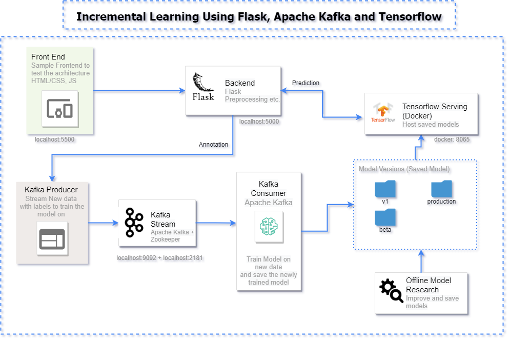

# WineTaster-MLMicroservice

WineTaster-MLMicroservice is a robust machine learning microservice designed to predict wine quality through an interactive web interface. This service utilizes Kafka for handling data streams, TensorFlow for predictive modeling, and Flask as the web framework.

## Description
Developed a Microservice based architecture having 5 different components
1. Frontend (Simple HTML/CSS + JS website to test the architecture)
2. Backend (Flask, KafkaClient class - Producer and Consumer to emit and consume new data and train and save model respectively)
3. Tensorflow Serving on Docker (Docker)
4. Saved Models (Folder having different saved versions of the model, used by Tensorflow serving to provide a API)

## Features

- Predict wine quality in real-time using machine learning models.
- Microservice architecture for easy scaling and maintenance.
- User-friendly web interface for direct interactions with the model.
- Kafka integration for reliable data processing and streaming.

## Getting Started

These instructions will get you a copy of the project up and running on your local machine for development and testing purposes.

### Prerequisites

What things you need to install the software:

- Python 3.x
- Apache Kafka
- TensorFlow
- Docker

### Installing

A step-by-step series of examples that tell you how to get a development environment running:

1. Clone the repository:

```bash
git clone https://github.com/your-username/WineTaster-MLMicroservice.git
```

2. Host the frontend/index.html or Open it in a browser

3. Start the Flask backend (backend/tensorflow-module.py) on a terminal
```console
python3 tensorflow-module.py
```

4. Open a new terminal, Start our Increment Model (containing Kafka consumer) (model/increment_model.py)
```console
python3 increment_model.py
```

5. Start Tensorflow serving on Docker
- Pull tensorflow serving image from dockerhub
```console
docker pull tensorflow/serving
docker pull emacski/tensorflow-serving // for Mac
```

- Run the docker image 
```console
docker run -it -v <path-to-model-folder>/model:/inc_model_kafka -p 8605:8605 --entrypoint /bin/bash tensorflow/serving
docker run -it -v <path-to-model-folder>/model:/inc_model_kafka -p 8605:8605 --entrypoint /bin/sh emacski/tensorflow-serving // Mac
```

Here `inc_model_kafka` is just a sample name for the new folder that will be created in the docker container, you can use any other name

- After this you should entered in shell of the docker container, last step is to start the tensorflow server:

```console
tensorflow_model_server --port=8500 --rest_api_port=8605 --model_config_file=/inc_model_kafka/model.config
```

After everything is up and running you can start interacting with the frontend and as you go on add new data your new model will stored in `model/saved_model` directory

----------
## Architecture
All the components interact together in a way shown below:




## ML in practice
The online machine learning paradigm is a bit different from the traditional/conventional way of training machine learning models.
- In traditional approaches the dataset is fixed and the model iterates over it n number of times. 
- In online learning, the model continues to incrementally learn/update it's parameters as soon as the new data points are available and this process is expected to continue indefinitely. 

## References

- [Installing Apache Kafka](https://www.conduktor.io/kafka/how-to-install-apache-kafka-on-mac/)
- [Tensorflow Online Learning](https://www.tensorflow.org/io/tutorials/kafka#online_learning)
- [Using Docker for Serving Tensorflow](https://www.youtube.com/watch?v=P-5sMcpTE0g)
